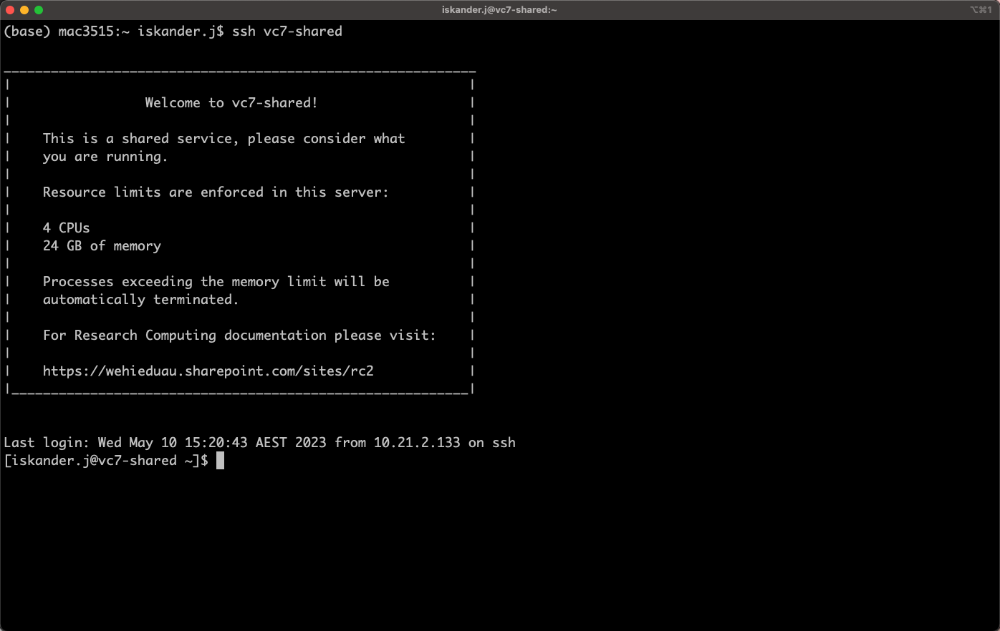
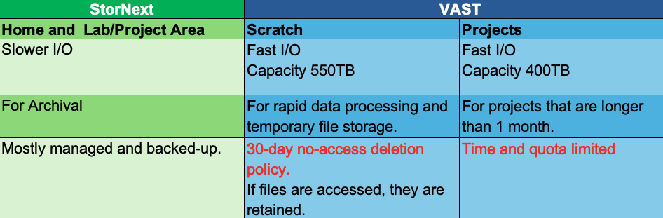
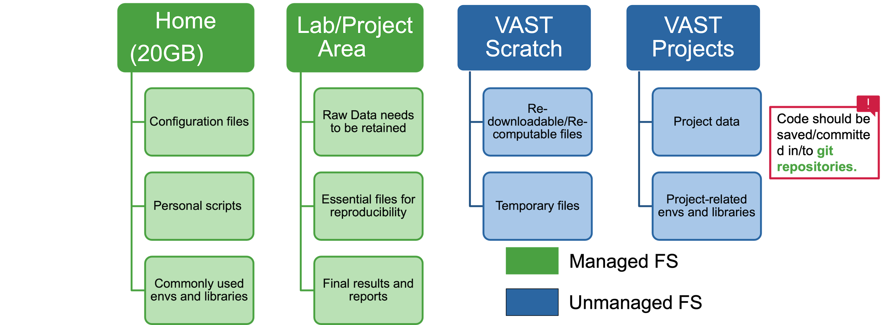
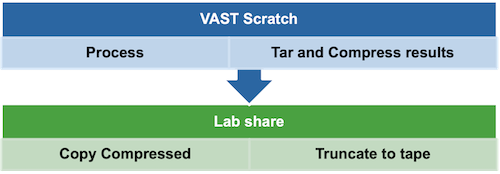

:::::::::::::::::::::::::::::::::::::: questions 

- How do I log in to `Milton`?
- Where can I store my data?

::::::::::::::::::::::::::::::::::::::::::::::::

::::::::::::::::::::::::::::::::::::: objectives

- Connect to `Milton`.
- Identify where to save your data

::::::::::::::::::::::::::::::::::::::::::::::::

## Milton Cluster

Milton is linux-based cluster, that is made up of two login nodes and many computer nodes in addition to the file systems.

### What is a nodes made up of?

* Physical cores
* Memory
* Local storage


## Connect to Milton

The first step in using a cluster is to establish a connection from your laptop to the cluster. 

You need a Windows Command Prompt or macOS Terminal, to connect to a login node and access the command line (CLI). 

::: challenge

Exercise: Can you login to Milton?

If not in WEHI, make sure you are on the VPN. Open your terminal and login to vc7-shared.

More details are available [here](https://wehieduau.sharepoint.com/sites/rc2/SitePages/using-milton.aspx#ssh-(command-line)-sessions-(slurm)).

:::::: solution
* For Mac OSX users
   * `ssh vc7-shared`
   * Type your password

* For MS-Windows users
   * Download and install the free [PuTTY client](https://putty.org).

* You can also use [Cluster Access on Ope nOnDemand](https://ondemand.hpc.wehi.edu.au/pun/sys/shell/ssh/slurm-login.hpc.wehi.edu.au)

::::::
:::


You will be asked for your password. Watch out: the characters you type after
the password prompt are not displayed on the screen. Normal output will resume
once you press `Enter`.

You will notice that the prompt changed when you logged into the remote system using the terminal. 



## Milton FileSystems






### How data move between File System according to requirements?




## Looking Around Your Home

We will now run through some linux commands to look around the login node.

::: challenge

Exercise: Check the name of the current
node we are logged into

:::::: solution
```
$ hostname
vc7-shared.hpc.wehi.edu.au
```
So, we're definitely on the remote machine.
::::::

:::

::: challenge

Exercise: Find out which directory we are in.

:::::: solution
Run `pwd`  (**p**rint the **w**orking **d**irectory.)
```
$ pwd
/home/users/allstaff/<username>
```
Instead of `<username>`, your username will appear. This is your HOME directory ($HOME)
::::::

:::

::: challenge

Exercise: List all files and folders in your Home directory

:::::: solution

```
$ ls
```
will print a list of files/directories in the directory.

::::::

:::

::: challenge

Exercise: Disconnect your session

:::::: solution

```
$ exit
```
or
```
$ logout
```
::::::

:::

For more on Linux commands, visit [our guide](https://wehieduau.sharepoint.com/sites/rc2/SitePages/Linux.aspx) or watch the recording of the workshops [here](https://wehieduau.sharepoint.com/sites/rc2/SitePages/RCP-Training.aspx)


::::::::::::::::::::::::::::::::::::: keypoints 

- HPC systems typically provide login nodes and a set of compute nodes.
- Files saved on one node are available on all nodes.
- Milton has multiple different file systems that have different policies.
- Throughout a research project, research data may move between file systems according to backup and retention requirements, and to improve performance.
::::::::::::::::::::::::::::::::::::::::::::::::
