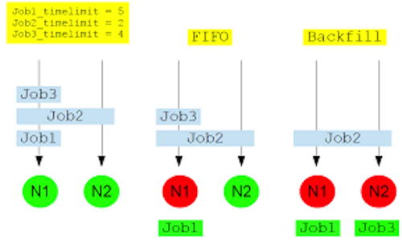

:::::::::::::::::::::::::::::::::::::: questions 

- What is a scheduler and why does a cluster need one?
- What is a partition?

::::::::::::::::::::::::::::::::::::::::::::::::

::::::::::::::::::::::::::::::::::::: objectives

- Explain what is a scheduler
- Explain how Milton's Slurm works
- Identify the essential options to set for a job

::::::::::::::::::::::::::::::::::::::::::::::::

## Job Scheduler

An HPC system might have thousands of nodes and thousands of users. A _scheduler_ is a special piece of software that decides which jobs run where and when. It also ensures that a task is run with the
resources it requested. 

The following illustration compares these tasks of a job scheduler to a waiter in a restaurant. If you can relate to an instance where you had to wait for a while in a queue to get in to a popular restaurant, then you may now understand why sometimes your job do not start instantly as in your laptop.

Milton uses a scheduler (batch system) called Slurm. WEHI has 3500 physical cores, 44TB of memory, 58 GPUs and 90 nodes accessible by Slurm. 

The user describes the work to be done and resources required in a script or at the command line, then submits the script to the batch system. The work is scheduled when resources are available and consistent with policy set by administrators.

## Slurm 

### [Simple Linux Utility for Resource Management](https://Slurm.schedmd.com/documentation.html)

Slurm development has been a joint effort of many companies and organizations around the world. Over 200 individuals have contributed to Slurm. Its development is lead by [SchedMD](https://www.schedmd.com/). Its staff of developers and support personnel maintain the canonical Slurm releases, and are responsible for the majority of the development work for each new Slurm release. Slurm's design is very modular with about 100 optional plugins.
It is used at Spartan, Massive, Pawsey, Peter Mac and Milton, as well as HPC facilities world-wide.

### Fair Share
A cluster is a shared environment and when there is more work than resources available, there needs to be a mechanism to resolve contention. Policies ensure that everyone has a "fair share" of the resources.

Milton uses a [multifactor job priority policy](https://Slurm.schedmd.com/priority_multifactor.html#mfjppintro). It uses nine factors that influence job priority.

It is set such that:

* age: as the length of time a job has been waiting in the queue increases, the job priority increases.
* job size: the more resources (CPUs, GPUs, and/or memory), the higher priority.
* fair-share: the difference between the portion of the computing resource that has been requested and the amount of resources that has been consumed, i.e. the more resources your jobs have already used, the lower the priority of your next jobs.

In addition, no single user can have more than 8% of total CPUs or memory, which is **450 CPUs** and **3TB memory**.

### Backfilling

Milton uses a back-filling algorithm to improve system utilisation and maximise job throughput.

When more resource intensive jobs are running it is possible that gaps ends up in the resource allocation. To fill these gaps a best effort is made for low-resource jobs to slot into these spaces.

For example, on an 8-core node, an 8 core job is running, a 4 core job is launched, then an 8 core job, then another 4 core job. The two 4 core jobs will run before the second 8 core job.

if we have 2 8-core nodes, we receive:

* Job 1 request 4-cores and 5 hours limit
* Job 2 request 8-cores and 2 hours limit
* Job 3 request 4-cores and 4 hours limit

Without back filling, Job 2 will block the queue and Job 3 will have to wait until Job 2 is completed.
With back filling, when Job 1 has been allocated and Job 2 pending for resources, Slurm will look through the queue, searching for jobs that are small enough to fill the idle node. In this example, this means that Job 3 will start before Job 2 to "back-fill" the 4 CPUs that will be available for 5 hours while Job 1 is running.

### Slurm Partitions

Partitions in Slurm group nodes into logical (possibly overlapping) sets. A partition configuration defines job limits or access controls for a group of nodes. Slurm allocates resources to jobs within the selected partition by taking into consideration the resources you request for your job and the partition's available resources and restrictions.

| Partition | Purpose | Max submitted jobs/user |	Max CPUs/user |	Max mem (GB)/user |	Max wall time/job	| Max GPUs/user  |
|:---------:|:------------:|:---------:|:------------:|:---------:|:------------:|:------:|
| interactive | interactive jobs | 1 | 16 | 64| 24 hours | 0|
| regular	| most of the batch work | 5000 | 454 | 3000 | 48 hours | 0|
|long	| long-running jobs |  | 96 | 500 | 14-days | 0|
| gpuq | jobs that require GPUs | | 192 | 998 | 48 hours | 8 GPUs on 2 nodes |
| gpuq_large | jobs that require A100 GPUs | | 96 | 1000| 48 hours | 1 A100 |
| bigmem | jobs that require large amounts of memory | 500 | 128 | 1400| 48 hours| 0|

---

### The main parameters to set for any job script

* time: the maximum time for the job execution.
* cpus: number of CPUs
* partition: the partition in which your job is placed
* memory: the amount of physical memory
* special resources such as GPUs.

We will discuss this more in the next episode.

::::::::::::::::::::::::::::::::::::: keypoints 

- The scheduler handles how compute resources are shared between users.
- A job is just a shell script.
- Request _slightly_ more resources than you will need.
- Backfilling improves system utilisation and maximises job throughput. You can take advantage of backfilling by requesting only what you need.
- Milton Slurm has multiple partitions with different specification that fit the different types of jobs.

::::::::::::::::::::::::::::::::::::::::::::::::
