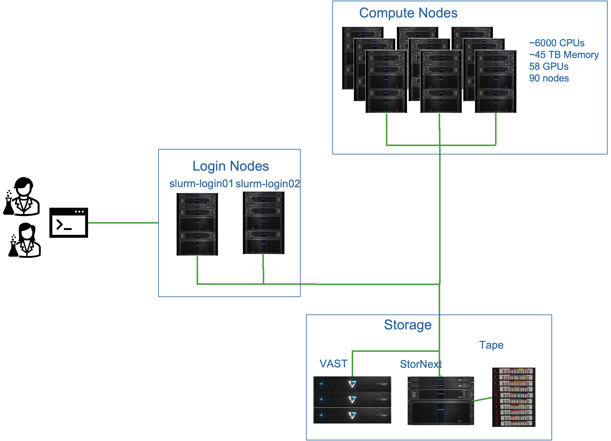
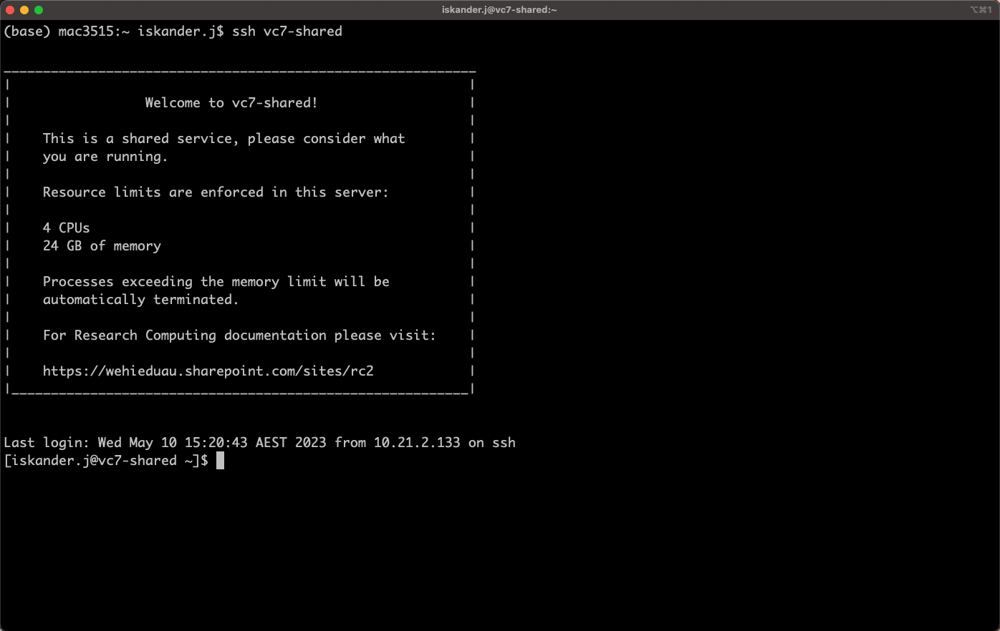

:::::::::::::::::::::::::::::::::::::: questions 

- How do I log in to `Milton`?
- How to use softwares on `Milton`?

::::::::::::::::::::::::::::::::::::::::::::::::

::::::::::::::::::::::::::::::::::::: objectives

- Connect to `Milton`.
- Access the `Modules` System.
- Load and remove modules.

::::::::::::::::::::::::::::::::::::::::::::::::

## Milton Cluster

Milton is linux-based cluster, that is made up of two login nodes and many computer nodes in addition to the filesystems.



The first step in using a cluster is to establish a connection from your laptop to the cluster. 

You need a Windows Command Prompt or macOS Terminal, to connect to a login node and access the commande line (CLI). 

::: challenge

Exercise: Can you login to Milton?

If not in WEHI, make sure you are on the VPN. Open your terminal and login to vc7-shared.

More details are available [here](https://wehieduau.sharepoint.com/sites/rc2/SitePages/using-milton.aspx#ssh-(command-line)-sessions-(slurm)).

:::::: solution
* For Mac OSX users
   * `ssh vc7-shared`
   * Type your password

* For MS-Windows users
   * Download and install the free [PuTTY client](http://putty.org).

* You can also use [Cluster Access on Ope nOnDemand](https://ondemand.hpc.wehi.edu.au/pun/sys/shell/ssh/slurm-login.hpc.wehi.edu.au)

::::::


You will be asked for your password. Watch out: the characters you type after
the password prompt are not displayed on the screen. Normal output will resume
once you press `Enter`.

You will notice that the prompt changed when you logged into the remote system using the terminal. 



## Looking Around Your Remote Home

We will now run through some linux commands to look around the login node.

::: challenge

Exercise: To check the name of the current
node we are logged

:::::: solution
```
$ hostname
```

```
vc7-shared.hpc.wehi.edu.au
```
So, we're definitely on the remote machine.
::::::

:::

::: challenge

Exercise: Find out which directory we are in.

:::::: solution
Run `pwd`  (**p**rint the **w**orking **d**irectory.)
```
$ pwd
```

```
/home/users/allstaff/<username>
```
Instead of `<username>`, your username will appear. This is your HOME directory ($HOME)
::::::

:::

::: challenge

Exercise: List all files and folders in your Home directory

:::::: solution

```
$ ls
```
will print a list of files/directories in the directory.

::::::

:::

::: challenge

Exercise: Disconnect your session

:::::: solution

```
$ exit
```
or
```
$ logout
```
::::::

:::

::::::::::::::::::::::::::::::::::::: keypoints 

- "HPC systems typically provide login nodes and a set of compute nodes."
- "Files saved on one node are available on all nodes."

::::::::::::::::::::::::::::::::::::::::::::::::
