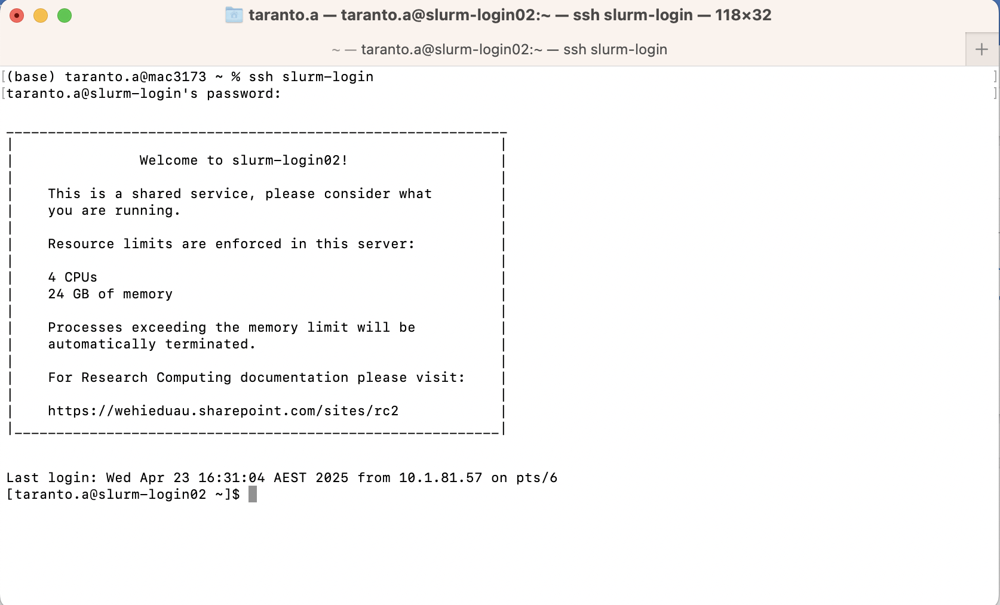
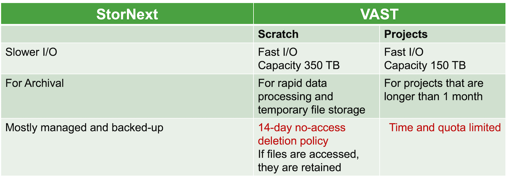
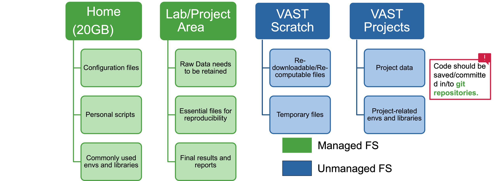
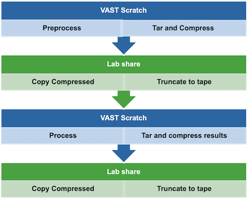
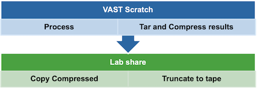

:::::::::::::::::::::::::::::::::::::: questions 

- How do I log in to `Milton`?
- Where can I store my data?

::::::::::::::::::::::::::::::::::::::::::::::::

::::::::::::::::::::::::::::::::::::: objectives

- Connect to `Milton`.
- Identify where to save your data

::::::::::::::::::::::::::::::::::::::::::::::::

## Milton Cluster

Milton is a linux-based cluster, that is made up of two login nodes and many computer nodes in addition to the file systems.

### What is a nodes made up of?

* Physical cores
* Memory
* Local storage
* Maybe GPU(s)


## Connect to Milton

The first step in using a cluster is to establish a connection from your laptop to the cluster. 
You need a Windows Command Prompt or macOS Terminal, to connect to a login node and access the command line interface (CLI). 


::: challenge

### Exercise 1: Can you login to Milton?

If not in WEHI, make sure you are on the VPN. While on a WEHI device, open your terminal and login to slurm-login.

More details are available [here](https://wehieduau.sharepoint.com/sites/rc2/SitePages/using-milton.aspx#ssh-(command-line)-sessions-(slurm)).

:::::: solution
* For Mac OSX users
   * `ssh slurm-login`
   * Type your password

* For MS-Windows users
   * Download and install the free [GitBash app](https://gitforwindows.org/).

* You can also use [Cluster Access on Open OnDemand](https://ondemand.hpc.wehi.edu.au/pun/sys/shell/ssh/slurm-login.hpc.wehi.edu.au)


::::::
:::


You will be asked for your password. 

**Watch out:** the characters you type after
the password prompt are not displayed on the screen. Normal output will resume
once you press `Enter`.

You will notice that the prompt changed when you logged into the remote system using the terminal. 



## Milton File Systems







### How data should be moved between file systems according to project requirements?


<br />
<br />



<br />
<br />



## Looking Around Your Home

We will now revise some linux commands to look around the login node.

::: challenge

### Exercise 2:Check the name of the current node
Get node name where you are logged into

:::::: solution

```bash
$ hostname
```

```output
slurm-login.hpc.wehi.edu.au
```

So, we're definitely on the remote machine.
::::::

:::

::: challenge

### Exercise 3: Find out which directory we are in.

:::::: solution
Run `pwd`  (**p**rint the **w**orking **d**irectory.)

```bash
pwd
```

```output
/home/users/allstaff/<username>
```
Instead of `<username>`, your username will appear. This is your HOME directory (`$HOME`)
::::::

:::

::: challenge

### Exercise 4: List all files and folders in your Home directory

:::::: solution

```bash
ls
```
will print a list of files/directories in the directory.

::::::

:::

::: challenge

### Exercise 5: Copy Exercise examples to your vast scratch or home directory

Copy exercise examples from Github to current directory,


:::::: solution

```bash
# Go to HOME dir
cd ~

# Download the demo.tar.gz file
curl -L -o demo.tar.gz https://github.com/WEHI-Education/Workshop-IntroToHPC-Slurm/raw/main/episodes/src/demo.tar.gz

# Decompress the tar.gz file
tar -xzvf demo.tar.gz

# Clean up the downloaded tar.gz file
rm demo.tar.gz
ls
```

::::::
:::

::: challenge

### Exercise 6: Disconnect your session

:::::: solution

```bash
exit
```
or
```bash
logout
```
::::::

:::

For more on Linux commands, visit [our guide](https://wehieduau.sharepoint.com/sites/rc2/SitePages/Linux.aspx) or watch the recording of the workshops [here](https://wehieduau.sharepoint.com/sites/rc2/SitePages/RCP-Training.aspx)


::::::::::::::::::::::::::::::::::::: keypoints 

- HPC systems typically provide login nodes and a set of compute nodes.
- Files saved on one node are available on all nodes.
- Milton has multiple different file systems that have different policies and characteristics.
- Throughout a research project, research data may move between file systems according to backup and retention requirements, and to improve performance.
::::::::::::::::::::::::::::::::::::::::::::::::
