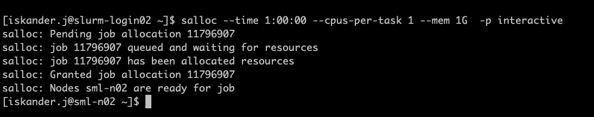
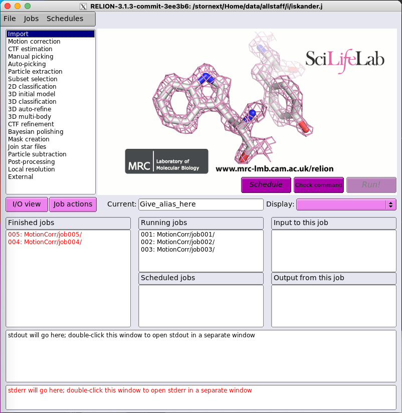

:::::::::::::::::::::::::::::::::::::: questions 

- How to start and exit an interactive SLURM job?

::::::::::::::::::::::::::::::::::::::::::::::::

::::::::::::::::::::::::::::::::::::: objectives

- Explain how to use `salloc` to run interactive jobs

::::::::::::::::::::::::::::::::::::::::::::::::

## Interactive jobs

Up to this point, we've focused on running jobs in batch mode. There are frequently tasks that need to be done interactively. Creating an
entire job script might be overkill, but the amount of resources required is
too much for a login node to handle. To solve this, SLURM provides the ability to start an interactive session.

Interactive sessions are **commonly used** for:

* Data management, eg. organising files, truncation and recall of files, downloading datasets
* Software/workflow preparation/testing, eg. developing/debugging scripts, downloading/building software
* Interactive data analysis
* Long-running processes such as workflow managers or simple web services.
* Rapid analysis cycles
* Running n application with a GUI.


On Milton, you can easily start an interactive job with `salloc`.

```
salloc --time 1:00:00 --cpus-per-task 1 --mem 1G  -p interactive
```



You will be presented with a bash prompt. Note that the prompt will change to reflect your new location (sml-n02 in the example), which is the compute node we are logged on. You can also verify this with hostname.


**Remember** that, you may have to wait resources, depending on the status of the queue you are requesting. We have designed the interactive partition to provide high availability, but only one job per user. 

The interactive job will be cancelled and removed from the queue, if your terminal session is terminated or closed, and/or internet connection is lost (connection with the slurm node lost). That's why it is recommended to use `screen` or `tmux`. When you have finished your task, please remember to close the session using `exit` or `^D`. You can also cancel the session using `scancel`. If you need more resources you can run interactive sessions in queues other than `interactive`.


## Creating remote graphics
To see graphical output inside your jobs, you need to use _X11 forwarding_. To connect with this feature enabled, use the `-Y`/`-X` option when you login to the login nodes or vc7-shared.  
```
ssh -Y vc7-shared
```

To use it in an interactive session add it to `--x11` to your `salloc` command

```
$ salloc --time 1:00:00 --cpus-per-task 1 --mem 1G  -p interactive --x11
salloc: Pending job allocation 11803274
salloc: job 11803274 queued and waiting for resources
salloc: job 11803274 has been allocated resources
salloc: Granted job allocation 11803274
salloc: Nodes sml-n03 are ready for job

$ module load relion
Loading Relion 3.1.3 using CUDA 11.2
Using MotionCor2 1.5.0 at /stornext/System/data/nvidia/motioncor2/motioncor2-1.5.0cu11.2/bin/motioncor2
No matching version of Gctf exists for CUDA 11.2
Using CTFFIND 4.1.14 at /stornext/System/data/nvidia/ctffind/ctffind-4.1.14/bin/ctffind

        WARNING: verify that the area where Relion will be used
        is not over its storage quota. If Relion is unable to write
        files this might cause severe corruption in the Relion
        pipeline star files.


Loading relion/3.1.3-cu11.2
  Loading requirement: cuda/11.2 mpich-slurm/3.4.2
$ relion
```



<br />

We will now have a live demo for more interactive options on Milton.


::::::::::::::::::::::::::::::::::::: keypoints 

- Use `salloc` to start a new interactive SLURM job.
- Use `--x11` with `salloc` to run remote graphics in your interactive job.

::::::::::::::::::::::::::::::::::::::::::::::::

